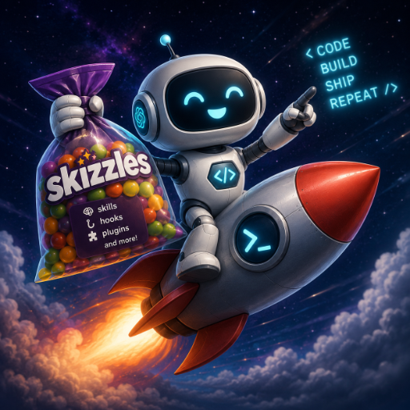

# Skizzles



**A neat little harness for making Codex work feel less like re-packing a suitcase.** Skizzles keeps reusable skills, optional hooks, runtime helpers, and release tooling in one reviewable source tree.

> **Pre-release:** this checkout is the canonical source and packaging project. No public Git remote or tagged stable release is configured yet, so the public install commands below become executable only after the repository and a versioned release are published.

## Choose your ride

### Stable distribution: the versioned plugin

The stable distribution is the versioned `skizzles` plugin. It bundles the skills, hooks, runtime helpers, logo, and marketplace metadata as one compatible release. The generated plugin at `plugins/skizzles/` is an output: build it from a tagged source checkout, never hand-edit it.

Install stable releases through the supported Codex plugin/marketplace flow for the release you selected. A plugin installation may enable its bundled hooks; review the release and trust it before enabling project tooling.

Skizzles does not modify an existing Codex installation, `PATH`, launchd, or another live plugin as part of development or packaging. Live cutover is a separate, explicit, human-approved operation.

### Plain skills: pick exactly what you need

After publication, use the Skills CLI when you want a single skill without the plugin runtime:

```sh
bunx skills add https://github.com/robertsale/skizzles --skill install-skizzles
```

Add more `--skill <name>` flags to select individual skills, or omit `--skill` to choose interactively. The installer can link a canonical copy for easy updates; use a copy only when links are unsuitable. Plain-skill installs **do not install Skizzles hooks, runtime helpers, or live configuration**.

### Develop against the source tree

From an owner-provided checkout (or from the public repository after publication), point the Skills CLI at the local canonical `skills/` directory and choose its symlink option:

```sh
git clone https://github.com/robertsale/skizzles.git
cd skizzles
bunx skills add ./skills --skill install-skizzles
```

`install-skizzles` is the LLM-facing, optional host-wiring guide. That source link is still a skill-only install and does not activate hooks or runtime helpers. The repo-local `package-skizzles` and `release-skizzles` skills are maintainer guidance, not public skill-install targets.

Full-harness development is a separate, deliberate linked/copied installer mode for the versioned plugin. It may expose the plugin's hooks and runtime in an isolated target, so keep it out of live configuration until an explicit cutover is approved. Before sharing a plugin build, run:

```sh
bun install --frozen-lockfile
bun run verify
```

`bun run plugin:build` stages the plugin deterministically, and `bun run plugin:check` proves that the checked-in generated plugin still matches the canonical source and passes the local plugin checks.

## What stays outside

Container Lab is an external runtime project. Skizzles may document compatibility, wrap its use in a skill, and diagnose it, but it never vendors, relocates, starts, or updates Container Lab. Its release tag/SHA and any runtime cutover must be chosen separately.

## Updating and starting fresh tasks

Plugins and new tasks intentionally use cached, versioned content. After installing or updating Skizzles, start a **new task** to pick up the selected version cleanly; do not expect an already-running task to reload skills or hooks. Keep a task on the version it started with, then update deliberately between tasks.

## Maintainers

Read [AGENTS.md](AGENTS.md) for source ownership, generated-file discipline, validation, Finder metadata, and checkpoint rules. The portable policy at [profiles/AGENTS.md](profiles/AGENTS.md) is opt-in; it is not copied or overwritten automatically.
