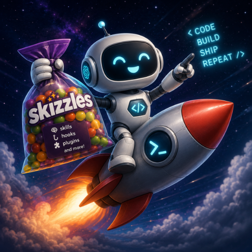

# Skizzles ✨



Skizzles is a friendly, reviewable Codex harness: reusable skills, helpful hooks, tiny runtime tools, and release packaging in one canonical source tree. It turns the fiddly parts of agent work into a tidy little toolkit. 🧰

Skizzles also includes a Grok Build harness with full root/Worker/Explorer/Reviewer prompts, a T3-facing Grok 4.6 High launcher with homogeneous child inheritance, a narrowly scoped subagent override guard, and a curated portable skill set. It is installed independently from the Codex plugin and never rewrites Grok's `config.toml`.

## What’s inside

- **Hot-reloadable local-development permissions** — approves a conservative set of build, test, and repo-contained patch operations before Guardian while leaving Git surgery, publication, and consequential work on the normal approval path.
- **Lean native orchestration** — Luna Max implements, Terra Medium explores, and Sol High supplies one adversarial terminal Review. Native Ultra-style fan-out stays available without a procedural obstacle course. 🗺️🤌
- **Usage analyzer** — privacy-conscious, read-only rollout analysis using an explicit `CODEX_HOME`.
- **Container Lab, batteries included** — a skill, full canonical source project, bundled CLI/reaper, compatibility descriptor, and safe doctor boundary for disposable Docker Compose labs. 🔬
- **T3 Code orchestration** — a worktree-first task collaboration skill plus bundled CLI/daemon for local or private-tailnet coordination across T3 projects, with an optional host-only settled-worktree artifact reaper. 🌳
- **Luna joins the V2 party** — an opt-in model-catalog overlay and tiny launchd refresher preserve the official catalog while enabling proven Luna workers in native MultiAgentV2. 🌙
- **Durable role brains** — tiny generated Default/Worker/Explorer/Reviewer overlays bind each duty to a configured model and reasoning effort that survives eviction and rework. 🧠✨
- **A practical skill shelf** — auth semantics, Cargo optimization, counterfactual engineering, design proof gates, legacy cleanup, Rinf boundaries, project tooling, and a gated designer runtime.
- **Installation help** — the public `install-skizzles` skill guides an LLM through optional host wiring after a skill-only install.
- **A polite config handshake** — enable the hooks, then choose passive native orchestration or proactive lean fan-out without trampling the rest of `config.toml`. 🤝

Everything is maintained once in the canonical roots and workspace packages, then staged into a versioned plugin. 🎯

## Pick your ride

### Stable plugin

**WIP:** Use the official Codex marketplace/plugin flow to install a released `skizzles` plugin. It packages the skills, hooks, runtime helpers, branding, and runnable Container Lab CLI/reaper together.

### Individual skills

Install just the skills you want with the Skills CLI:

```sh
bunx skills add https://github.com/robertsale/skizzles --skill install-skizzles
```

Add `--skill <name>` for another public skill, or omit it to choose interactively. Skill-only installs do not activate Skizzles hooks or runtime helpers; [install-skizzles](skills/install-skizzles/SKILL.md) explains the optional next steps.

### Source-linked development

For maintainer work, use a local checkout and point the Skills CLI at its canonical `skills/` directory:

```sh
git clone https://github.com/robertsale/skizzles.git
cd skizzles
bunx skills add ./skills --skill install-skizzles
```

Container Lab and T3 orchestration are fully included in this repository—not merely documented here. A source-linked installation runs the canonical runtimes directly from the checkout, while the stable plugin carries dependency-self-contained bundles. If you install only a copied skill, `install-skizzles` guides Codex through obtaining a selected Skizzles version and installing the complete surface; launchers can also use existing distinct PATH commands. Host PATH, LaunchAgent, Keychain, and Tailscale wiring are optional, explicit, and machine-local.

After installing the complete plugin surface, Skizzles can safely finish the Codex-side handshake:

- **Passive orchestration** enables the packaged hooks and leaves Codex’s native MultiAgentV2 defaults completely alone.
- **Aggressive orchestration** also enables MultiAgentV2, keeps fourteen task slots available for parallel work, and adds tiny role and ownership hints. 🚀
- **Native instructions** (the default) leave Codex's model instructions untouched.
- **Skizzles instructions** replace Codex's base model instructions with the full Skizzles harness contract and configure four fixed capability-bearing roles from the generated role catalog: Default/Worker use Luna Max, Explorer uses Terra Medium, and Reviewer uses Sol High. Select the generated `agent_type` without separate model overrides, and use a positive numbered fork so Codex applies the selected role instead of inheriting full parent context.

Preview the full developer setup from the checkout:

```sh
bun run packages/installer/src/cli.ts configure \
  --codex-home /absolute/target/codex-home \
  --codex-binary /absolute/path/to/codex \
  --orchestration aggressive \
  --instructions skizzles \
  --source-root /absolute/path/to/skizzles \
  --dry-run
```

Review the reported keys, then repeat without `--dry-run`. The lifecycle uses Codex’s own atomic config editor, preserves comments and unrelated settings, and records only the keys it owns for drift-safe restoration. It never edits `AGENTS.md`, approvals, permissions, goals, model defaults, or MCP registrations. Prompt replacement happens only with the explicit `--instructions skizzles` option. See [install-skizzles](skills/install-skizzles/SKILL.md) for restoration and the complete contract.

Install the source-linked Grok surface without enabling or authenticating the provider:

```sh
bun run packages/installer/src/cli.ts install \
  --surface grok --grok-home "$HOME/.grok" \
  --source-root "$PWD" --transfer link --dry-run
```

Review the targets, then repeat without `--dry-run`. Use `--transfer copy` for a durable installation or `link` only from a checkout that will remain at the recorded absolute path. The T3-facing launcher and security-sensitive global hook files are always copied into Grok's real directories. The receipt at `~/.grok/.skizzles/grok-harness-receipt.json` owns only those targets and makes uninstall drift-safe. Point T3's Grok provider at `~/.grok/bin/skizzles-grok`; the launcher selects `skizzles-root`, Grok 4.6, and High reasoning before starting ACP, while every child profile inherits that live configuration.

Install the Cursor Agent surface the same way. Cursor is a different harness: no Grok launcher, no Codex hooks, and no invented marketplace plugin.

```sh
bun run packages/installer/src/cli.ts install \
  --surface cursor --cursor-home "$HOME/.cursor" \
  --source-root "$PWD" --transfer link --dry-run
```

That writes portable skills to `~/.cursor/skills` and a local Cursor plugin to `~/.cursor/plugins/local/skizzles`. It never touches `~/.cursor/skills-cursor`. T3 `--provider cursor` selects catalog instance `cursor`, model `grok-4.6`, option `reasoning=high`, and `fastMode=false`.

The optional Luna V2 overlay lives in `runtime/model-catalog.ts`. It regenerates a complete static catalog from the newest valid normal cache or the installed Codex binary, changes only Luna's compatibility marker, and becomes a no-op when upstream enables V2 officially. Its launchd template watches both sources and runs every five minutes; catalog changes take effect after the next app-server restart. See `assets/model-catalog-installation.md` before activating it. 🚀

## Keep the loop delightful

Build and verify the generated plugin from source with:

```sh
bun install --frozen-lockfile
bun run verify
```

Agent roles are generated too: edit `assets/agent-role-spec.json` for the fixed capability pairs or `assets/agent-role-templates/` for duties, then run `bun run agents:build`. The checked-in `assets/agents/` directory is derived output and `bun run agents:check` guards it from hand-edited goblin drift. 👹

Plugins and new tasks use cached, versioned content, so start a fresh task after an update. For ownership, release rules, and safety details, see [AGENTS.md](AGENTS.md).

> **Pre-release note:** the Git-based examples become runnable once the repository and a versioned release are published. Stable marketplace publication remains a separate release step; host wiring is optional machine-local setup.
